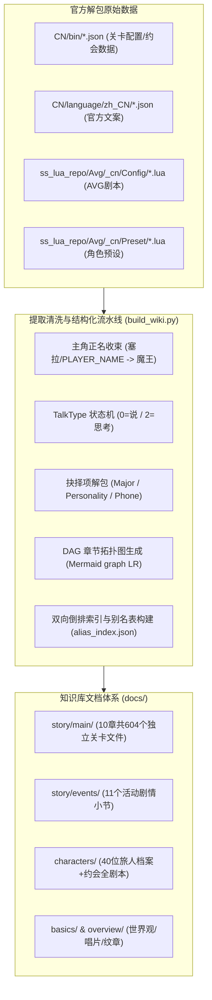

# 《星塔旅人》全量剧情与剧本知识库：独立建站与运维操作手册

> **文档版本**：v1.0.0  
> **数据基准**：官方公测客户端解包资产（包含 10 个主线篇章、11 个限时活动、40 位旅人专属档案与约会剧情）  
> **项目定位**：全网首个且唯一的《星塔旅人》1:1 逐句台词、分支抉择与拓扑导图高保真静态剧情数据库。

---

## 目录
1. [背景与全网现状调研](#一背景与全网现状调研)
2. [知识库核心架构与数据流](#二知识库核心架构与数据流)
3. [官方底层解析技术规范](#三官方底层解析技术规范)
   - [3.1 主角正名与代号收束（魔王）](#31-主角正名与代号收束魔王)
   - [3.2 灰色对话框与内心独白判定（TalkType）](#32-灰色对话框与内心独白判定talktype)
   - [3.3 三类交互抉择分支清洗机制](#33-三类交互抉择分支清洗机制)
4. [独立项目工程化方案（VitePress 静态站）](#四独立项目工程化方案vitepress-静态站)
5. [一键构建与生成指南](#五一键构建与生成指南)
6. [云端免费部署指南（Cloudflare Pages / Vercel）](#六云端免费部署指南cloudflare-pages--vercel)
7. [后续游戏版本更新与日常维护规范](#七后续游戏版本更新与日常维护规范)

---

## 一、 背景与全网现状调研

在目前的各大公开社区（B站 BWIKI、GameKee、Miraheze、NGA、贴吧等）中：
- **现有站点的局限**：所有的游戏资料站均聚焦于**数值养成、卡牌图鉴、副本关卡攻略、突破材料**，对于剧情仅提供粗略的文字大纲或指引去游戏内回看。
- **逐句台词与剧本的空白**：全网**没有任何一个公开网站**完整提取并结构化整理出游戏的**逐句剧情剧本、玩家分支抉择项、约会事件台词全文本**。
- **建站价值**：将本项目独立开源或部署为公共静态站，将填补全网《星塔旅人》剧情数据库的空白，成为玩家查阅剧情细节、考据世界观伏笔、二创作者检索台词的权威基准站。

---

## 二、 知识库核心架构与数据流

本项目的核心目标是**“零胡编、100% 官方数据源保真”**，采用自动化提取管道直接将 Unity 官方解包表转化为渐进式披露的 Markdown 文档树：



---

## 三、 官方底层解析技术规范

为保证剧本阅读体验与游戏内完全一致，生成管道解决了三个关键的引擎还原问题：

### 3.1 主角正名与代号收束（魔王）
- **现象**：官方预设表 `AvgCharacter.lua` 中，男女主角开发代号为 `avg3_100`（女）与 `avg3_101`（男），名称均被硬编码为 `"塞拉"`（开发期代号）。
- **机制**：在游戏客户端中，该代号由引擎动态替换为玩家身份；主线剧情中主角的核心身份与公认称呼为**“魔王”**。
- **规范**：
  - 覆盖映射表：`avg3_100`、`avg3_101`、`avg3_1311`、`avg3_1312`、`1` 统一映射为 **“魔王”**。
  - 变量清洗：所有原文字符串中的 `==PLAYER_NAME==` 自动清洗替换为 **“魔王”**。

### 3.2 灰色对话框与内心独白判定（TalkType）
- **现象**：游戏内玩家常有未说出口的思考与内心独白，对话框呈现为灰色气泡。
- **机制**：根据官方剧本定义 `AvgCmdParamOptionDefine.lua`，`SetTalk` 的第 1 个参数为 `TalkType`：
  - `0`：角色说（NPC/其他旅人正常发言）
  - `1`：主角说（魔王对外正常说出的话）
  - `2`：**主角想**（官方枚举定义为“主角想”，对应**灰色对话框**）
- **规范**：
  - 当 `TalkType == 2` 时，发言人统一输出为：  
    `**魔王**（思考）：「……」`
  - 正常发言则输出为：  
    `**魔王**：「……」`

### 3.3 三类交互抉择分支清洗机制
官方 Lua 剧本中共有三类玩家交互指令，需彻底剔除 UI 预制体名字与引擎跳转标签：
1. **重大分支抉择 (`SetMajorChoice`)**：
   - 提取顶层的提问句（如 `该选哪个呢？`、`菲莱公司的未来，要怎么走呢？`）。
   - 将每个分支解析为 `【标题】: 【副标题/说明】`。
   - 剔除 `AvgChoice_item_*`、`E101`、`c`、`020` 等布局参数。
   - 渲染模板：
     ```markdown
     > **[重大抉择：该选哪个呢？]**
     > - **趁着夜色潜入**：没有计划的计划就是好计划
     > - **让密涅瓦侦查**：有算胜无算，多算胜少算
     > - **考虑其他办法**：藏在箱子里混进去
     ```
2. **性格回答抉择 (`SetPersonalityChoice`)**：
   - 提取 3 种不同性格/态度的回复选项，渲染为：
     ```markdown
     > **[玩家抉择：我该怎么回答她呢]**
     > - 你就是管理采购商店的布洛可吧？
     > - 我第一次来采购商店，你是谁？
     > - 光顾着领每日奖励了，没想到商店里居然有人。
     ```
3. **终端通讯短信抉择 (`SetPhoneMsgChoiceBegin`)**：
   - 过滤 `avg3_100` 标记，格式化为 `> **[通讯回复抉择]**`。

---

## 四、 独立项目工程化方案（VitePress 静态站）

推荐使用 **VitePress** 搭建静态剧情站（毫秒级启动、原生支持 Markdown 与 Mermaid、内置深色模式与全文搜索，国内 ACG 维基主流框架）。

### 推荐项目目录结构
```text
stellasora-wiki/
├── .github/
│   └── workflows/
│       └── deploy.yml          # GitHub Actions 自动化部署脚本
├── data/                       # 存放官方解包资产（不提交或提交至 LFS）
│   ├── StellaSoraData/         # JSON 数据源
│   └── ss_lua/                 # Lua 剧本数据源
├── scripts/
│   ├── build_wiki.py           # 核心知识库生成脚本
│   └── generate_nav.py         # 自动读取 Markdown 生成 VitePress 侧边栏
├── docs/                       # VitePress 站点根目录（由脚本生成）
│   ├── .vitepress/
│   │   └── config.mts          # 站点配置、Mermaid 插件与搜索配置
│   ├── index.md                # 知识库站点首页
│   ├── basics/                 # 世界观与基础设定
│   ├── story/                  # 主线与活动剧情独立小节
│   ├── characters/             # 40 位角色档案与约会剧情
│   └── public/                 # 静态资源与封面图
├── package.json
└── README.md
```

---

## 五、 一键构建与生成指南

### 1. 安装环境
- **Python**：3.10 或更高版本
- **Node.js**：18.0 或更高版本

### 2. 初始化前端依赖
```bash
npm init -y
npm install -D vitepress mermaid vitepress-plugin-mermaid
```

### 3. 配置 VitePress (`docs/.vitepress/config.mts`)
```typescript
import { defineConfig } from 'vitepress'
import { withMermaid } from 'vitepress-plugin-mermaid'

export default withMermaid(
  defineConfig({
    title: "星塔旅人 编年史与剧情资料馆",
    description: "全网首个 1:1 官方高保真剧情剧本与设定知识库",
    themeConfig: {
      nav: [
        { text: '首页', link: '/' },
        { text: '主线章节', link: '/story/main/overview' },
        { text: '活动剧情', link: '/story/events/overview' },
        { text: '旅人名册', link: '/characters/overview' },
        { text: '世界观', link: '/basics/world_view' }
      ],
      search: {
        provider: 'local' // 内置客户端离线全文搜索
      },
      socialLinks: [
        { icon: 'github', link: 'https://github.com/your-username/stellasora-wiki' }
      ]
    }
  })
)
```

### 4. 执行一键生成
在本地项目根目录下运行 Python 构建脚本：
```bash
python scripts/build_wiki.py
```
> 输出结果将自动覆盖 `docs/` 目录，生成全部 600+ 篇独立小节文档、Mermaid 拓扑图与索引表。

### 5. 本地预览静态站
```bash
npx vitepress dev docs
```
浏览器打开 `http://localhost:5173` 即可浏览具有完整导航栏、流程图与台词的现代化剧情站。

---

## 六、 云端免费部署指南（Cloudflare Pages / Vercel）

静态剧情站构建后仅为 HTML/JS/CSS，完全不需要购买服务器，直接使用免备案且全球高速 CDN 托管。

### 方案 A：Cloudflare Pages（推荐，国内访问顺畅且无流量费用）
1. 将整理好的代码仓库推送到 GitHub。
2. 登录 [Cloudflare Dashboard](https://dash.cloudflare.com/) -> 选择 **Workers & Pages** -> **Create application** -> **Pages**。
3. 连接 GitHub 仓库并配置构建参数：
   - **Framework preset**：`VitePress`
   - **Build command**：`npm run docs:build`
   - **Build output directory**：`docs/.vitepress/dist`
4. 点击 **Save and Deploy**，即可获得永久免费且自动支持 HTTPS 的独立二级域名（例如 `stellasora.pages.dev`），支持绑定自定义域名。

### 方案 B：Vercel（一键式极速部署）
1. 登录 [Vercel](https://vercel.com/)，点击 **Add New Project**。
2. 导入 GitHub 仓库，Framework Preset 选择 `VitePress`。
3. 点击 **Deploy**，约 1 分钟内自动部署上线。

---

## 七、 后续游戏版本更新与日常维护规范

当官方推出新主线或新活动时，按以下三步无痛更新：
1. **替换官方解包资产**：将最新解包出的 `Story.json`、`ActivityStory.json` 与新的 Lua 剧本放入 `data/` 目录。
2. **运行构建脚本**：再次执行 `python scripts/build_wiki.py`，增量关卡与新角色小节将自动生成，Mermaid 流程图自动重算。
3. **Git 提交并推送**：
   ```bash
   git add docs/
   git commit -m "feat: 更新主线第十章与新活动剧情"
   git push origin main
   ```
   Cloudflare Pages 或 Vercel 将通过 Webhook 自动触发部署，30 秒内全站自动同步更新。
