# 《星塔旅人》全量剧情与剧本知识库：独立建站与运维操作手册

> **文档版本**：v2.0.0（2026-10-10 大更：架构章按当前实现重写，规模数字改为动态口径）
> **数据基准**：官方公测版本资产（涵盖主线各章节、限时活动、旅人专属档案与好感剧情、秘闻与故事集）
> **项目定位**：全网首个且唯一的《星塔旅人》1:1 逐句台词、分支抉择与拓扑导图高保真静态剧情数据库。
> **配套文档**：实现细节、踩坑与判据见 `_dev/AI_HANDOVER_GUIDE.md`；本手册讲"怎么建站、怎么运维"。

---

## 目录
1. [背景与全网现状调研](#一背景与全网现状调研)
2. [知识库核心架构与数据流](#二知识库核心架构与数据流)
3. [官方底层解析技术规范](#三官方底层解析技术规范)
   - [3.1 主角正名与代号收束（魔王）](#31-主角正名与代号收束魔王)
   - [3.2 灰色对话框与内心独白判定（TalkType）](#32-灰色对话框与内心独白判定talktype)
   - [3.3 交互抉择与历史条件分支清洗机制](#33-交互抉择与历史条件分支清洗机制)
4. [静态站方案：纯 Python 生成 site/](#四静态站方案纯-python-生成-site)
5. [构建与本地预览](#五构建与本地预览)
6. [部署](#六部署)
7. [后续游戏版本更新与日常维护规范](#七后续游戏版本更新与日常维护规范)
8. [契约校验与故障排查](#八契约校验与故障排查)
9. [遗留产物 docs/ 说明](#九遗留产物-docs-说明)

---

## 一、 背景与全网现状调研

在目前的各大公开社区（B站 BWIKI、GameKee、Miraheze、NGA、贴吧等）中：
- **现有站点的局限**：所有的游戏资料站均聚焦于**数值养成、卡牌图鉴、副本关卡攻略、突破材料**，对于剧情仅提供粗略的文字大纲或指引去游戏内回看。
- **逐句台词与剧本的空白**：全网**没有任何一个公开网站**完整提取并结构化整理出游戏的**逐句剧情剧本、玩家分支抉择项、约会事件台词全文本**。
- **建站价值**：将本项目独立开源或部署为公共静态站，将填补全网《星塔旅人》剧情数据库的空白，成为玩家查阅剧情细节、考据世界观伏笔、二创作者检索台词的权威基准站。

---

## 二、 知识库核心架构与数据流

本项目的核心目标是**"零胡编、100% 官方数据源保真"**，采用自动化提取管道直接将 Unity 官方解包表转化为渐进式披露的 Markdown 文档树，再由纯 Python 静态站引擎编译成站点。

```mermaid
flowchart TD
    subgraph DataSources["官方解包原始数据 (data/)"]
        A1["CN/bin/*.json<br/>(关卡配置/约会数据/条件表)"]
        A2["CN/language/zh_CN/*.json<br/>(官方文案)"]
        A3["ss_lua/Avg/_cn/Config/*.lua<br/>(AVG 剧本)"]
        A4["ss_lua/Avg/_cn/Preset/*.lua<br/>(角色/词表预设)"]
    end

    subgraph StoryPipeline["剧情编译管线 (scripts/story/)"]
        B1["lua_lexer → lua_parser → command_ir<br/>(Stage 1 前端)"]
        B2["passes：动画帧折叠 / 说话人解析 /<br/>抉择分支归属 / 历史条件标记"]
        B3["conditions：历史条件 ID → 中文标签"]
        B4["markup：内联标记 / 官方词表 / 强调配对"]
        B5["graph_layout：DAG 章节拓扑几何"]
        B6["diagnostics：兜底统一登记"]
    end

    subgraph StoryDocs["人审真源 (story_docs/)"]
        C1["main/ events/ characters/ npc_bonds/<br/>discs/ storysets/ prologue/<br/>dispatch/ battles_unmounted/"]
        C2["_data/*.json：chapters / sections /<br/>search / personality（meta 带权威计数）"]
        C3["_beats/*.json：PageDoc IR 侧车"]
        C4["_diagnostics.json：上游异常与兜底登记"]
        C5["_coverage.md / _battle_reconciliation.md"]
    end

    subgraph SitePipeline["静态站引擎 (scripts/site/)"]
        D1["release_gate：未开放内容门控"]
        D2["render_html：beat IR → HTML 正文 + ruby 注音"]
        D3["site_templates：拓扑图 / 阅读牌板 / 战斗档案"]
        D4["site_css / site_js：设计令牌 / 离线检索 / 拓扑手势"]
    end

    subgraph Output["发布产物 (site/)"]
        E1["全量静态 HTML（可双击 index.html 离线用）"]
        E2["site/data/*.json + search.js（已过门控）"]
    end

    DataSources --> StoryPipeline
    StoryPipeline --> StoryDocs
    StoryDocs --> SitePipeline
    SitePipeline --> Output
```



**四条设计主线**（改架构前先读懂）：

1. **人审真源与站点产物分离**。`story_docs/` 是逐句校验过的人工核对基准（两份校验器的对照真源），`site/` 是发布产物。站点不再从 md 文本反解结构（早期 `md2html.py` 反编译层已删除），而是与 `render_md.py` **共同消费同一份 `_beats/*.json` PageDoc IR**，因此不存在"第二套渲染器"与产物漂移。
2. **坐标进数据不进代码**。`graph_layout.layout()` 由 `build_story.py` 调用，布局在**建站之前**就能被校验（契约 H）。
3. **发布面单独设闸**。`release_gate.py` 在站点消费任何侧车之前按官方 `OpenTime`/`StartTime` 过滤，未开放组只出占位与提示页，零台词泄露（门控检查）。
4. **兜底不崩 + 必登记**。`pipeline/diagnostics.py` 是唯一的降级登记处；定时同步以 `check=True` 跑生成器，任何未捕获异常都会停摆整条流水线，所以解析/渲染路径一律"产出可读结果 + 登记"，详见 `_dev/AI_HANDOVER_GUIDE.md` 3.6。

> 📏 **规模数字不写死**：各族篇数、页数、台词行数一律以 `story_docs/_data/*.json` 的 `meta` 字段、
> `story_docs/_coverage.md` 与两个校验器结尾的汇总为准。本手册不抄具体数字——抄了就会过时。

---

## 三、 官方底层解析技术规范

为保证剧本阅读体验与游戏内完全一致，生成管道解决了三个关键的引擎还原问题：

### 3.1 主角正名与代号收束（魔王）
- **现象**：官方预设表 `AvgCharacter.lua` 中，男女主角开发代号为 `avg3_100`（女）与 `avg3_101`（男），名称均被硬编码为 `"塞拉"`（开发期代号）。
- **机制**：在游戏客户端中，该代号由引擎动态替换为玩家身份；主线剧情中主角的核心身份与公认称呼为**“魔王”**。
- **规范**：
  - 覆盖映射表：`avg3_100`、`avg3_101`、`avg3_1311`、`avg3_1312`、`1` 统一映射为 **“魔王”**。
  - 变量清洗：所有原文字符串中的 `==PLAYER_NAME==` 自动清洗替换为 **“魔王”**。

### 3.2 灰色对话框与内心独白判定（TalkType）
- **现象**：游戏内玩家常有未说出口的思考与内心独白，对话框呈现为灰色气泡。
- **机制**：根据官方剧本定义 `AvgCmdParamOptionDefine.lua`，`SetTalk` 的第 1 个参数为 `TalkType`：
  - `0`：角色说（NPC/其他旅人正常发言）
  - `1`：主角说（魔王对外正常说出的话）
  - `2`：**主角想**（官方枚举定义为“主角想”，对应**灰色对话框**）
- **规范**：
  - 当 `TalkType == 2` 时，发言人统一输出为：  
    `**魔王**（思考）：「……」`
  - 正常发言则输出为：  
    `**魔王**：「……」`

### 3.3 交互抉择与历史条件分支清洗机制
官方 Lua 剧本里的分支结构分**两大类、四小类**，前一类由玩家当场操作触发，后一类由玩家存档状态触发：

#### A. 玩家当场抉择（`Set*Choice` 家族，帧栈机制）
1. **重大分支抉择 (`SetMajorChoice`)**：
   - 提取顶层的提问句（如 `该选哪个呢？`、`菲莱公司的未来，要怎么走呢？`）。
   - 将每个分支解析为 `【标题】: 【副标题/说明】`。
   - 剔除 `AvgChoice_item_*`、`E101`、`c`、`020` 等布局参数。
   - 渲染模板：
     ```markdown
     > **[重大抉择：该选哪个呢？]**
     > - **趁着夜色潜入**：没有计划的计划就是好计划
     > - **让密涅瓦侦查**：有算胜无算，多算胜少算
     > - **考虑其他办法**：藏在箱子里混进去
     ```
2. **性格回答抉择 (`SetPersonalityChoice`)**：
   - 提取 3 种不同性格/态度的回复选项，渲染为：
     ```markdown
     > **[玩家抉择：我该怎么回答她呢]**
     > - 你就是管理采购商店的布洛可吧？
     > - 我第一次来采购商店，你是谁？
     > - 光顾着领每日奖励了，没想到商店里居然有人。
     ```
3. **终端通讯短信抉择 (`SetPhoneMsgChoiceBegin`)**：
   - 过滤 `avg3_100` 标记，格式化为 `> **[通讯回复抉择]**`。

**分支归属按 `group` 查帧栈，不按行序配对**（存在 4 层嵌套且 `Set*ChoiceEnd` 不满足 LIFO 的实例）。
分支首条台词前插 `> **[若选「选项标题」↓]**`，帧栈清空时插一条汇合标记。只有一个选项的"单选项抉择"
不画分支框（上游 `CG_126_03` 的 End group 错配会导致 5 个单选项被反复标分支，游戏内不可见），
由站点侧的一组检查独立盯住。

#### B. 历史条件分支（`IfUnlock` / `IfTrue` / `CheckBE` 家族，2026-10-09 接入）
由玩家**此前的存档状态**分流，与当场选择无关：

| 指令族 | 判据 | 渲染示例 |
|---|---|---|
| `IfUnlock`/`IfUnlockElse`/`IfUnlockEnd` | `StoryCondition` 表：读过哪些剧情、取得哪些证据、完成哪些成就、世界等级 | `若已阅读《终局 指尖的沙》、《终局 身旁的她》、《终局 遥远的塔》` / `否则，若…` / `否则` |
| `IfTrue`/`EndIf` | 当时在某个抉择里选了哪项 | `若已选择《07 不同的许愿》中的「放弃思考」` |
| `CheckBE`/`CheckBECase`/`CheckBEEnd` | 终局已阅读比例落在哪个区间 | `若第一章至第八章的终局已阅读比例为 0%` |

```markdown
> **[历史条件分支]**
> - 若第一章至第八章的终局已阅读比例为 0%
**魔王**（思考）：「不，不对，在过去的冒险里，我也没少遇到危险……」
> **[历史条件分支]**
> - 若第一章至第八章的终局已阅读比例大于 0%，且不超过 8%
> - 若第一章至第八章的终局已阅读比例大于 8%，且小于 100%
> - 若第一章至第八章的终局已阅读比例为 100%
**魔王**（思考）：「不，不对。在过去的冒险里，我又不是没遇到死亡的情况……」
> **[▲ 历史条件分支到此汇合]**
```

多个分支正文**完全相同**时只保留一份正文、标签合并列出（第十章等"多周目"剧情四个分支往往只差结尾
一两句，不去重会让档案看起来是断裂重复）。站点侧额外渲染"跳到汇合"导航与 `condition-merge-N` 锚点。

---

## 四、 静态站方案：纯 Python 生成 `site/`

站点由纯 Python 模块化脚本负责，全部只依赖标准库，不需要 npm：

| 模块分类 | 脚本路径 | 输入 | 输出 | 核心职责 |
|---|---|---|---|---|
| **剧情处理** | `scripts/story/pipeline/diagnostics.py` | 各降级点注入的收集器 | （无 IO，只被 build_story 汇总） | 兜底统一登记：`Diagnostics` 收集器 + `CATEGORIES` 分类注册表 + 统一 `warn()`；所有"降级不崩"都必须在这里登记 |
| **剧情处理** | `scripts/story/pipeline/lua_lexer.py` / `lua_parser.py` | `Config/*.lua` | token 流 / T 表 | Stage 1 前端：真正的 Lua 词法 + 递归下降语法（平衡括号、转义还原、`nil/true/false`） |
| **剧情处理** | `scripts/story/pipeline/command_ir.py` | T 记录序列 | `[Command]` | 带稳定 `idx` 的命令序列；动画帧折叠以 `idx` 为身份，不再用 `id()` |
| **剧情处理** | `scripts/story/pipeline/passes.py` | `[Command]` + 说话人/编译器 | beat 列表 | Stage 2 语义：帧折叠、说话人解析、抉择分支归属、历史条件标记 |
| **剧情处理** | `scripts/story/pipeline/conditions.py` | 5 张官方表 + 4 张文案表 | 中文标签 / 分支标记 | 历史条件（已阅读/已选择/终局比例）解析与共享正文合并 |
| **剧情处理** | `scripts/story/pipeline/markup.py` | 词表 + 台词原文 | 内联节点树 | 性别变体、注音、强调配对、官方词表、未知标记保留原文 |
| **剧情处理** | `scripts/story/pipeline/speakers.py` | `AvgCharacter.lua` 预设 | 显示名 | 说话人 id → 显示名（预置表 + 最长点分前缀兜底） |
| **剧情处理** | `scripts/story/pipeline/pagedoc.py` / `render_md.py` | beat 列表 | PageDoc IR / Markdown | md 与 HTML 两个后端的共同上游；`render_md` 产物是人审真源（字节锁） |
| **剧情处理** | `scripts/story/build_story.py` | `data/` 解包表 + AVG 剧本 | `story_docs/`（md + `_data/*.json` + `_beats/*.json` + `_diagnostics.json`） | 编译管线编排、魔王正名、独白识别、图谱生成、上游异常与编译器兜底登记（口径由注册表生成） |
| **剧情处理** | `scripts/story/graph_layout.py` | 节点关系 (`sid/parents`) | 列、轨道、SVG 坐标 | DAG 分层拓扑几何纯函数（无 IO） |
| **剧情处理** | `scripts/story/release_gate.py` | 官方 `OpenTime`/`StartTime` | 过滤后的 pages/chapters | 未开放内容门控：只出占位与提示页，零台词泄露 |
| **静态站点** | `scripts/site/build_site.py` | `story_docs/_data/` + `_beats/` | `site/` 全量静态页面 | 站点编译主入口（消费前先过 release_gate） |
| **静态站点** | `scripts/site/site_templates.py` | 关卡元数据与排版内容 | 结构化 HTML 字符串 | 拓扑图、剧情阅读牌板、战斗档案等页面模板 |
| **静态站点** | `scripts/site/site_css.py` | 设计规范 Tokens | `site/assets/tokens.css` | 主题变量、深浅色、牌板、SVG 拓扑样式 |
| **静态站点** | `scripts/site/site_js.py` | 前端交互事件 | `site/assets/site.js` | 离线即时检索、拓扑平移拖拽缩放、回到顶部 |
| **静态站点** | `scripts/site/render_html.py` | `story_docs/_beats/*.json`（PageDoc 侧车） | 干净的 HTML 片段 | beat IR → 正文 HTML、抉择/分支锚点与 `<ruby><rt>` 注音转换 |
| **自动化CI** | `scripts/automation/auto_sync.py` | GitHub 上游最新提交 | 全量增量更新 & CI 产物 | 自动化监控两上游变更，提取差异并触发自动化发布（`check=True`，故生成器不可抛异常） |
| **自动化CI** | `scripts/automation/changelog_from_commits.py` | 提交区间 | README 更新记录 | push 事件驱动的变更日志 |
| **辅助工具** | `scripts/tools/run_benchmark.py` | 基准测试用例集 | 耗时与性能报告 | 性能压测与解析效率分析 |
| **辅助工具** | `scripts/tools/golden_snapshot.py` | 语料 | 黄金快照 | 对拍旧实现，防回归 |
| **遗留工具** | `scripts/tools/build_wiki.py` | `data/` | `docs/` | 早期原型生成器，已不在主链路；见第九章 |

> 注：根目录 `scripts/` 下保留了 `build_site.py`、`build_story.py` 与 `auto_sync.py` 的轻量转发器，直接在根目录执行旧命令依然 100% 兼容。`build_wiki.py` **没有**转发器，需写全路径。

内容真源是 `story_docs/` 的 Markdown（它已被逐句校验过，是两份校验器的对照真源）；
站点正文则由 `story_docs/_beats/*.json`（PageDoc IR 侧车，`build_story` 的 `record_page`
落盘）渲染：`scripts/story/pipeline/render_md.py` 与 `scripts/site/render_html.py` 是共同
消费同一份 beat IR 的两个平行后端，站点不再从 md 文本反解结构（旧的 `md2html.py`
反编译层已删除），因此不存在"第二套渲染器"与产物漂移的问题。

**主线节点图**：边取 `Story.ParentStoryId`，卡面编号取 `Story.Index` 的文案，章头取
`StoryChapter` 的 `Name/Desc/ChapterYear`。列 = 最长路径深度，轨道 = 分叉围绕父节点上下展开、
汇合取父轨道均值，一遍重心扫描降交叉。坐标写进 `chapters.json`，页面只是把卡片按坐标摆好、
连线画在一张扁平 SVG 里。

**已知边界（不要当成 bug）**：
- 表 `StoryChapter.Id` 与游戏内章号差一章（Id 7 = 特别篇、Id 8 = 第七章），站内按游戏内章号显示。
- 官方界面每条时间槽属于哪一列写在 UI 预制体里，解包表内没有，所以节点时间条取该关剧本自己的
  场景头（`猎月 14日 10:36`），不冒充官方的按列分组文案。
- 特别篇全无 `ParentStoryId`，官方就没记录连线，页面按编号顺序列出并注明。
- 游戏右下角"直觉/分析/混沌"百分比来自玩家存档，表里只有三轴定义，本站不显示数值。

VitePress 作为备选保留在 `package.json` 的 `docs:*` 脚本里，未安装依赖，也不参与当前构建。

## 五、 构建与本地预览

```bash
# 剧情库：解析上游数据 -> story_docs/（md + 侧车）
python scripts/build_story.py            # 或 python scripts/story/build_story.py

# 静态站：story_docs/ -> site/
python scripts/build_site.py             # 或 python scripts/site/build_site.py

# 契约回归（两个都要跑，都要全绿）
python tests/story/validate_story.py     # story_docs 侧
python tests/story/validate_site.py      # site 侧

# 单元测试
python -m pytest tests -q

# 本地预览
python -m http.server 8000 --directory site
```

直接双击 `site/index.html` 也能完整使用：检索索引以 `site/data/search.js` 形式内嵌，
绕开了 `file://` 不能 `fetch()` 本地 JSON 的限制。

`build_story.py` 每次运行**先删后写** `story_docs/`，所以不要在里面放任何手工文件。
`--out <目录>` 可把产物写到别处（仅供校验用，例如诊断侧车的临时目录重建），默认仍是 `story_docs/`。

## 六、 部署

站点是纯静态目录，任何静态托管都行，两种常见做法：

1. **CI 里构建**（推荐，仓库不带产物）：构建命令 `python scripts/build_story.py && python scripts/build_site.py`，
   输出目录 `site`，运行时选 Python 3.10+。Cloudflare Pages 与 Vercel 都支持。
2. **本地构建后上传**：把 `site/` 整目录拖进 Cloudflare Pages / 对象存储 / 任意静态空间。

若改用 VitePress 前端，需要重写第四节并让 `docs/.vitepress/` 消费同一份 `_data/*.json`——
数据结构与渲染层是解耦的，换栈不必重跑解析。

## 七、 后续游戏版本更新与日常维护规范

当官方推出新主线或新活动时，按以下标准流水线更新：

1. **替换官方解包资产**：将最新解包出的配置表放入 `data/StellaSoraData/CN/bin/` 与文案目录，将新 AVG 剧本放入 `data/ss_lua/.../Config/`。
2. **运行构建脚本**：
   ```bash
   python scripts/build_story.py    # 提取官方数据 -> story_docs/ 与 _data/*.json
   python scripts/build_site.py     # 编译静态站 -> site/
   ```
3. **运行契约回归测试**（任一变红都不要提交）：
   ```bash
   python tests/story/validate_story.py
   python tests/story/validate_site.py
   python -m pytest tests -q
   ```
4. **人审 diff**：重点看 `story_docs/_diagnostics.json` 有没有新增登记——那是上游数据结构变动或
   管线兜底被触发的信号，逐条确认是"上游真变了"还是"管线该修了"（见第八章）。
5. **Git 提交并推送**：
   ```bash
   git add story_docs/ site/
   git commit -m "feat: 更新最新游戏版本剧情与剧本档案"
   git push origin main
   ```
   静态托管平台（如 Cloudflare Pages / Vercel / GitHub Pages）将自动同步最新站点。

## 八、 契约校验与故障排查

### 8.1 两套契约集（互不依赖，都不 import 生成器）

| 校验器 | 盯什么 | 契约组 |
|---|---|---|
| `tests/story/validate_story.py` | `story_docs/` 对旧产物、对剧本原文 | `A` `A2` 跳过概要/逐句台词；`B` 气泡逐阶段；`C` 行来源计数；`D`/`E`/`F` 变异 + 挂载审计 + 全树逐页；`K` 气泡挂章；`M`/`M2` 注音保真；`M3` 单选项抉择；`P` 诊断侧车 |
| `tests/story/validate_site.py` | `site/` 对 `story_docs/` 与剧本 | `G`/`G2`/`G3` 节点重导与对账；`H`/`H2`/`H3` 几何与落点；`I`/`I2` HTML==md 逐句；`J`/`J2` 检索索引；`L`/`L2` 抉择角标；`M`/`M2` 锚点与气泡；`M3` 单选项；`N`/`N2` 未开放门控 |

每个契约组都带**植入变异测试**：故意改坏产物，同一套断言必须抓到。只看"正对照 PASS"不算数。

### 8.2 常见故障对照

| 现象 | 先查哪里 |
|---|---|
| `validate_story.py` 报 A/A2 分歧 | 是不是改了 `render_md.py` 的渲染逻辑，或 `docs/`（遗留基线，见第九章）被手工动过 |
| 报 F「计数与剧本指令数矛盾」 | 新接入的族没在 `write_coverage()` 登记，或挂载规则变了但旧文件没删（build 先删后写，重跑一次） |
| 报 K 违例 | 战斗气泡拼名规则：必须用关卡 `StoryId` 里的章号，**不是** `Story.Chapter` |
| 报未开放门控违例 | 新族/新页面没进 `release_gate`，或新侧车没在 `strip_locked_from_data()` 里加一条 |
| 报 P3「重建漂移」 | `_diagnostics.json` 与当前代码不同构：要么提交物过期（重跑 build），要么 `CATEGORIES` 改了但产物没重建 |
| `build_story.py` 中途异常退出 | 看 `_diagnostics.json` 新增了哪些登记；管线方针是"降级不崩 + 必登记"，异常说明有兜底漏网，按 3.6 补登记而不是 try/except 吞掉 |
| 定时同步 CI 失败 | `auto_sync.py` 用 `check=True`，生成器任何未捕获异常都会停摆；同上 |

### 8.3 兜底与诊断（`pipeline/diagnostics.py`）

所有"不抛异常、改变/保留原文"的降级都登记进 `story_docs/_diagnostics.json`，三条纪律：

1. **降级不崩** —— 遇到上游脏数据产出**可读**结果；
2. **必登记** —— 每次降级都过 `Diagnostics.add()/bump()/extend()`，只打 logger/print 不算登记；
3. **分类必须进注册表** —— `CATEGORIES` 是唯一真源，未注册分类名直接 `KeyError`（故意的）。

分类口径、新增分类怎么写、为什么结构型缺参不登记，见 `_dev/AI_HANDOVER_GUIDE.md` 3.6。
**人审 diff 时把 `_diagnostics.json` 的变化当作上游数据变动的信号灯。**

## 九、 遗留产物 `docs/` 说明

`docs/`（约 5 MB、500+ 文件，**仍在 git 跟踪下**）是早期原型生成器 `scripts/tools/build_wiki.py`
的输出。它的初衷是把剧情库做成"渐进式披露、便于 AI 检索"的知识库（按世界观/角色/剧情分层组织），
后来主链路转向 `story_docs/` + 静态站 + `_beats/` IR 方案，可校验性与发布可控性都更强，
`build_wiki.py` 遂退出主链路（它的正则参数解析还有两个硬缺陷，见 AI_HANDOVER_GUIDE 7.1）。

**它今天唯一的用途**：`tests/story/validate_story.py` 的 `A`/`A2` 历史对照契约以它为基线，
盯住"新实现没有悄悄改掉已评审内容"。

**纪律**：
1. **不要手工编辑** `docs/` —— 改了会让 A/A2 的"旧产物"失真；
2. **不要删除** `docs/` —— A/A2 会直接失败；
3. 可再生（`python scripts/tools/build_wiki.py`），但重新生成等于重置历史基线，做之前先想清；
4. 它不参与 CI 构建，也不随站点发布。

将来若要做 AI 检索向的知识库，正确做法是基于 `story_docs/_data/*.json` 侧车另做投影，
而不是复活 `build_wiki.py`。
