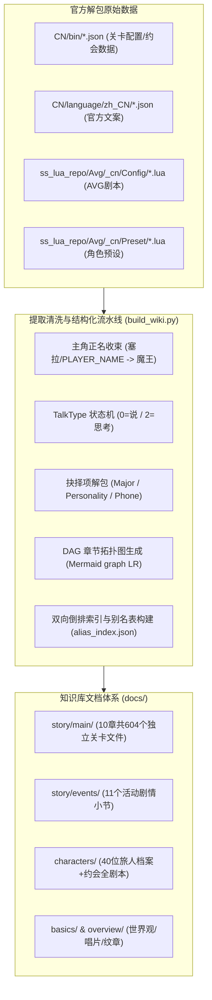

# 《星塔旅人》全量剧情与剧本知识库：独立建站与运维操作手册

> **文档版本**：v1.0.0  
> **数据基准**：官方公测版本资产（涵盖主线各章节、限时活动、旅人专属档案与好感剧情、秘闻与故事集）  
> **项目定位**：全网首个且唯一的《星塔旅人》1:1 逐句台词、分支抉择与拓扑导图高保真静态剧情数据库。

---

## 目录
1. [背景与全网现状调研](#一背景与全网现状调研)
2. [知识库核心架构与数据流](#二知识库核心架构与数据流)
3. [官方底层解析技术规范](#三官方底层解析技术规范)
   - [3.1 主角正名与代号收束（魔王）](#31-主角正名与代号收束魔王)
   - [3.2 灰色对话框与内心独白判定（TalkType）](#32-灰色对话框与内心独白判定talktype)
   - [3.3 三类交互抉择分支清洗机制](#33-三类交互抉择分支清洗机制)
4. [静态站方案：纯 Python 生成 site/](#四静态站方案纯-python-生成-site)
5. [构建与本地预览](#五构建与本地预览)
6. [部署](#六部署)
7. [后续游戏版本更新与日常维护规范](#七后续游戏版本更新与日常维护规范)

---

## 一、 背景与全网现状调研

在目前的各大公开社区（B站 BWIKI、GameKee、Miraheze、NGA、贴吧等）中：
- **现有站点的局限**：所有的游戏资料站均聚焦于**数值养成、卡牌图鉴、副本关卡攻略、突破材料**，对于剧情仅提供粗略的文字大纲或指引去游戏内回看。
- **逐句台词与剧本的空白**：全网**没有任何一个公开网站**完整提取并结构化整理出游戏的**逐句剧情剧本、玩家分支抉择项、约会事件台词全文本**。
- **建站价值**：将本项目独立开源或部署为公共静态站，将填补全网《星塔旅人》剧情数据库的空白，成为玩家查阅剧情细节、考据世界观伏笔、二创作者检索台词的权威基准站。

---

## 二、 知识库核心架构与数据流

本项目的核心目标是**“零胡编、100% 官方数据源保真”**，采用自动化提取管道直接将 Unity 官方解包表转化为渐进式披露的 Markdown 文档树：



---

## 三、 官方底层解析技术规范

为保证剧本阅读体验与游戏内完全一致，生成管道解决了三个关键的引擎还原问题：

### 3.1 主角正名与代号收束（魔王）
- **现象**：官方预设表 `AvgCharacter.lua` 中，男女主角开发代号为 `avg3_100`（女）与 `avg3_101`（男），名称均被硬编码为 `"塞拉"`（开发期代号）。
- **机制**：在游戏客户端中，该代号由引擎动态替换为玩家身份；主线剧情中主角的核心身份与公认称呼为**“魔王”**。
- **规范**：
  - 覆盖映射表：`avg3_100`、`avg3_101`、`avg3_1311`、`avg3_1312`、`1` 统一映射为 **“魔王”**。
  - 变量清洗：所有原文字符串中的 `==PLAYER_NAME==` 自动清洗替换为 **“魔王”**。

### 3.2 灰色对话框与内心独白判定（TalkType）
- **现象**：游戏内玩家常有未说出口的思考与内心独白，对话框呈现为灰色气泡。
- **机制**：根据官方剧本定义 `AvgCmdParamOptionDefine.lua`，`SetTalk` 的第 1 个参数为 `TalkType`：
  - `0`：角色说（NPC/其他旅人正常发言）
  - `1`：主角说（魔王对外正常说出的话）
  - `2`：**主角想**（官方枚举定义为“主角想”，对应**灰色对话框**）
- **规范**：
  - 当 `TalkType == 2` 时，发言人统一输出为：  
    `**魔王**（思考）：「……」`
  - 正常发言则输出为：  
    `**魔王**：「……」`

### 3.3 三类交互抉择分支清洗机制
官方 Lua 剧本中共有三类玩家交互指令，需彻底剔除 UI 预制体名字与引擎跳转标签：
1. **重大分支抉择 (`SetMajorChoice`)**：
   - 提取顶层的提问句（如 `该选哪个呢？`、`菲莱公司的未来，要怎么走呢？`）。
   - 将每个分支解析为 `【标题】: 【副标题/说明】`。
   - 剔除 `AvgChoice_item_*`、`E101`、`c`、`020` 等布局参数。
   - 渲染模板：
     ```markdown
     > **[重大抉择：该选哪个呢？]**
     > - **趁着夜色潜入**：没有计划的计划就是好计划
     > - **让密涅瓦侦查**：有算胜无算，多算胜少算
     > - **考虑其他办法**：藏在箱子里混进去
     ```
2. **性格回答抉择 (`SetPersonalityChoice`)**：
   - 提取 3 种不同性格/态度的回复选项，渲染为：
     ```markdown
     > **[玩家抉择：我该怎么回答她呢]**
     > - 你就是管理采购商店的布洛可吧？
     > - 我第一次来采购商店，你是谁？
     > - 光顾着领每日奖励了，没想到商店里居然有人。
     ```
3. **终端通讯短信抉择 (`SetPhoneMsgChoiceBegin`)**：
   - 过滤 `avg3_100` 标记，格式化为 `> **[通讯回复抉择]**`。

---

## 四、 静态站方案：纯 Python 生成 `site/`

站点由纯 Python 模块化脚本负责，全部只依赖标准库，不需要 npm：

| 模块分类 | 脚本路径 | 输入 | 输出 | 核心职责 |
|---|---|---|---|---|
| **剧情处理** | `scripts/story/build_story.py` | `data/` 解包表 + AVG 剧本 | `story_docs/`（md + `_data/*.json` + `_beats/*.json` + `_diagnostics.json`） | 编译管线编排、魔王正名、独白识别、图谱生成、上游异常登记 |
| **剧情处理** | `scripts/story/graph_layout.py` | 节点关系 (`sid/parents`) | 列、轨道、SVG 坐标 | DAG 分层拓扑几何纯函数（无 IO） |
| **静态站点** | `scripts/site/build_site.py` | `story_docs/_data/` + `_beats/` | `site/` 全量静态页面 | 站点编译主入口，驱动模板引擎生成 549 篇产物 |
| **静态站点** | `scripts/site/site_templates.py` | 关卡元数据与排版内容 | 结构化 HTML 字符串 | 拓扑图、剧情阅读牌板、战斗档案等页面模板 |
| **静态站点** | `scripts/site/site_css.py` | 设计规范 Tokens | `site/assets/tokens.css` | 主题变量、深浅色、牌板、SVG 拓扑样式 |
| **静态站点** | `scripts/site/site_js.py` | 前端交互事件 | `site/assets/site.js` | 离线即时检索、拓扑平移拖拽缩放、回到顶部 |
| **静态站点** | `scripts/site/render_html.py` | `story_docs/_beats/*.json`（PageDoc 侧车） | 干净的 HTML 片段 | beat IR → 正文 HTML、抉择/分支锚点与 `<ruby><rt>` 注音转换 |
| **自动化CI** | `scripts/automation/auto_sync.py` | GitHub 上游最新提交 | 全量增量更新 & CI 产物 | 自动化监控两上游变更，提取差异并触发自动化发布 |
| **辅助工具** | `scripts/tools/run_benchmark.py` | 基准测试用例集 | 耗时与性能报告 | 性能压测与解析效率分析 |

> 注：根目录 `scripts/` 下保留了 `build_site.py`、`build_story.py` 与 `auto_sync.py` 的轻量转发器，直接在根目录执行旧命令依然 100% 兼容。

内容真源是 `story_docs/` 的 Markdown（它已被逐句校验过，是契约 A–F/I/M3 的对照真源）；
站点正文则由 `story_docs/_beats/*.json`（PageDoc IR 侧车，`build_story` 的 `record_page`
落盘）渲染：`scripts/story/pipeline/render_md.py` 与 `scripts/site/render_html.py` 是共同
消费同一份 beat IR 的两个平行后端，站点不再从 md 文本反解结构（旧的 `md2html.py`
反编译层已删除），因此不存在"第二套渲染器"与产物漂移的问题。

**主线节点图**：边取 `Story.ParentStoryId`，卡面编号取 `Story.Index` 的文案，章头取
`StoryChapter` 的 `Name/Desc/ChapterYear`。列 = 最长路径深度，轨道 = 分叉围绕父节点上下展开、
汇合取父轨道均值，一遍重心扫描降交叉。坐标写进 `chapters.json`，页面只是把卡片按坐标摆好、
连线画在一张扁平 SVG 里。

**已知边界（不要当成 bug）**：
- 表 `StoryChapter.Id` 与游戏内章号差一章（Id 7 = 特别篇、Id 8 = 第七章），站内按游戏内章号显示。
- 官方界面每条时间槽属于哪一列写在 UI 预制体里，解包表内没有，所以节点时间条取该关剧本自己的
  场景头（`猎月 14日 10:36`），不冒充官方的按列分组文案。
- 特别篇 12 行全无 `ParentStoryId`，官方就没记录连线，页面按编号顺序列出并注明。
- 游戏右下角"直觉/分析/混沌"百分比来自玩家存档，表里只有三轴定义，本站不显示数值。

VitePress 作为备选保留在 `package.json` 的 `docs:*` 脚本里，未安装依赖，也不参与当前构建。

## 五、 构建与本地预览

```bash
python scripts/build_story.py && python scripts/build_site.py   # 或 npm run build
python tests/story/validate_story.py && python tests/story/validate_site.py   # 契约 A–K
python -m http.server 8000 --directory site                     # 或 npm run serve
```
直接双击 `site/index.html` 也能完整使用：检索索引以 `site/data/search.js` 形式内嵌，
绕开了 `file://` 不能 `fetch()` 本地 JSON 的限制。

## 六、 部署

站点是纯静态目录，任何静态托管都行，两种常见做法：

1. **CI 里构建**（推荐，仓库不带产物）：构建命令 `python scripts/build_story.py && python scripts/build_site.py`，
   输出目录 `site`，运行时选 Python 3.10+。Cloudflare Pages 与 Vercel 都支持。
2. **本地构建后上传**：把 `site/` 整目录拖进 Cloudflare Pages / 对象存储 / 任意静态空间。

若改用 VitePress 前端，需要重写第四节并让 `docs/.vitepress/` 消费同一份 `_data/*.json`——
数据结构与渲染层是解耦的，换栈不必重跑解析。

## 七、 后续游戏版本更新与日常维护规范

当官方推出新主线或新活动时，按以下标准流水线更新：
1. **替换官方解包资产**：将最新解包出的配置表放入 `data/StellaSoraData/CN/bin/` 与文案目录，将新 AVG 剧本放入 `data/ss_lua/.../Config/`。
2. **运行构建脚本**：
   ```bash
   python scripts/build_story.py    # 提取官方数据 -> story_docs/ 与 _data/*.json
   python scripts/build_site.py     # 编译静态站 -> site/
   ```
3. **运行契约回归测试**：
   ```bash
   python tests/story/validate_story.py
   python tests/story/validate_site.py
   ```
4. **Git 提交并推送**：
   ```bash
   git add story_docs/ site/
   git commit -m "feat: 更新最新游戏版本剧情与剧本档案"
   git push origin main
   ```
   静态托管平台（如 Cloudflare Pages / Vercel / GitHub Pages）将自动同步最新站点。
