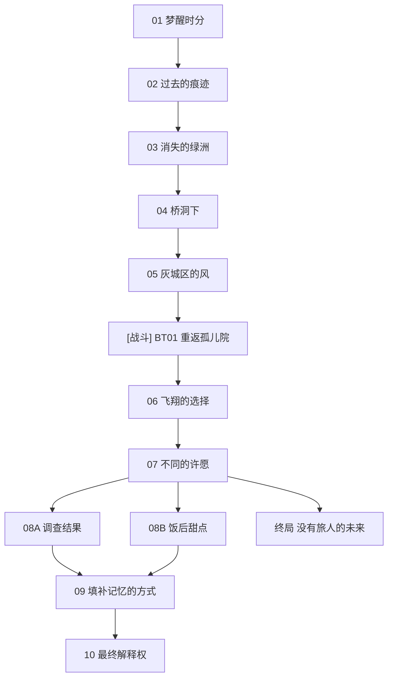

# 主线 第一章《没有记忆的生物》 概览

## 章节基本信息
- **章节全称**：第一章 《没有记忆的生物》
- **发生时间**：星塔历 996 年
- **包含小节数**：共 13 个小节（包含剧情关卡与战斗关卡）

## 章节剧情分支路线图 (Story Route DAG)
以下流程图清晰展示了本章所有关卡的推进顺序、分支路径、战斗节点与可能达成的各路线结局：

## 关卡小节列表与剧情直达 (Sections)
| 关卡编号 | 关卡名称 | 类型 | 推荐等级 | 独立小节剧情与台词文档 |
| :--- | :--- | :--- | :--- | :--- |
| BT01 | 重返孤儿院 | ⚔️ 战斗关卡 | Lv.5 | [重返孤儿院](./sections/100_BT01_重返孤儿院.md) |
| 01 | 梦醒时分 | 📖 剧情关卡 | Lv.- | [梦醒时分](./sections/101_01_梦醒时分.md) |
| 02 | 过去的痕迹 | 📖 剧情关卡 | Lv.- | [过去的痕迹](./sections/102_02_过去的痕迹.md) |
| 03 | 消失的绿洲 | 📖 剧情关卡 | Lv.- | [消失的绿洲](./sections/103_03_消失的绿洲.md) |
| 04 | 桥洞下 | 📖 剧情关卡 | Lv.- | [桥洞下](./sections/104_04_桥洞下.md) |
| 05 | 灰城区的风 | 📖 剧情关卡 | Lv.- | [灰城区的风](./sections/105_05_灰城区的风.md) |
| 06 | 飞翔的选择 | 📖 剧情关卡 | Lv.- | [飞翔的选择](./sections/106_06_飞翔的选择.md) |
| 07 | 不同的许愿 | 📖 剧情关卡 | Lv.- | [不同的许愿](./sections/107_07_不同的许愿.md) |
| 08A | 调查结果 | 📖 剧情关卡 | Lv.- | [调查结果](./sections/108_08A_调查结果.md) |
| 08B | 饭后甜点 | 📖 剧情关卡 | Lv.- | [饭后甜点](./sections/109_08B_饭后甜点.md) |
| 终局 | 没有旅人的未来 | 📖 剧情关卡 | Lv.- | [没有旅人的未来](./sections/110_终局_没有旅人的未来.md) |
| 09 | 填补记忆的方式 | 📖 剧情关卡 | Lv.- | [填补记忆的方式](./sections/111_09_填补记忆的方式.md) |
| 10 | 最终解释权 | 📖 剧情关卡 | Lv.- | [最终解释权](./sections/112_10_最终解释权.md) |
