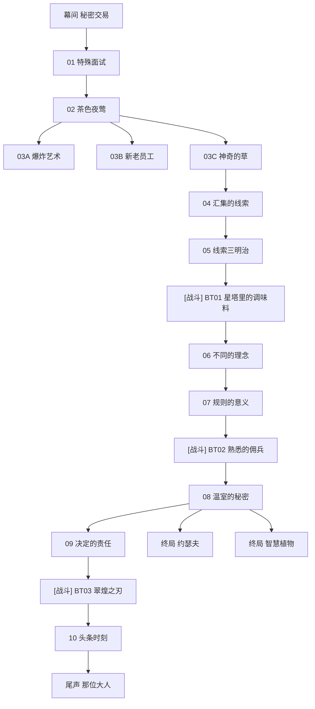

# 主线 第五章《落于暗夜的荧光》 概览

## 章节基本信息
- **章节全称**：第五章 《落于暗夜的荧光》
- **发生时间**：星塔历 996 年
- **包含小节数**：共 19 个小节（包含剧情关卡与战斗关卡）

## 章节剧情分支路线图 (Story Route DAG)
以下流程图清晰展示了本章所有关卡的推进顺序、分支路径、战斗节点与可能达成的各路线结局：

## 关卡小节列表与剧情直达 (Sections)
| 关卡编号 | 关卡名称 | 类型 | 推荐等级 | 独立小节剧情与台词文档 |
| :--- | :--- | :--- | :--- | :--- |
| BT01 | 星塔里的调味料 | ⚔️ 战斗关卡 | Lv.- | [星塔里的调味料](./sections/501_BT01_星塔里的调味料.md) |
| BT02 | 熟悉的佣兵 | ⚔️ 战斗关卡 | Lv.- | [熟悉的佣兵](./sections/502_BT02_熟悉的佣兵.md) |
| BT03 | 翠煌之刃 | ⚔️ 战斗关卡 | Lv.- | [翠煌之刃](./sections/503_BT03_翠煌之刃.md) |
| 幕间 | 秘密交易 | 📖 剧情关卡 | Lv.- | [秘密交易](./sections/504_幕间_秘密交易.md) |
| 01 | 特殊面试 | 📖 剧情关卡 | Lv.- | [特殊面试](./sections/505_01_特殊面试.md) |
| 02 | 茶色夜莺 | 📖 剧情关卡 | Lv.- | [茶色夜莺](./sections/506_02_茶色夜莺.md) |
| 03A | 爆炸艺术 | 📖 剧情关卡 | Lv.- | [爆炸艺术](./sections/507_03A_爆炸艺术.md) |
| 03B | 新老员工 | 📖 剧情关卡 | Lv.- | [新老员工](./sections/508_03B_新老员工.md) |
| 03C | 神奇的草 | 📖 剧情关卡 | Lv.- | [神奇的草](./sections/509_03C_神奇的草.md) |
| 04 | 汇集的线索 | 📖 剧情关卡 | Lv.- | [汇集的线索](./sections/510_04_汇集的线索.md) |
| 05 | 线索三明治 | 📖 剧情关卡 | Lv.- | [线索三明治](./sections/511_05_线索三明治.md) |
| 06 | 不同的理念 | 📖 剧情关卡 | Lv.- | [不同的理念](./sections/512_06_不同的理念.md) |
| 07 | 规则的意义 | 📖 剧情关卡 | Lv.- | [规则的意义](./sections/513_07_规则的意义.md) |
| 08 | 温室的秘密 | 📖 剧情关卡 | Lv.- | [温室的秘密](./sections/514_08_温室的秘密.md) |
| 终局 | 约瑟夫 | 📖 剧情关卡 | Lv.- | [约瑟夫](./sections/515_终局_约瑟夫.md) |
| 09 | 决定的责任 | 📖 剧情关卡 | Lv.- | [决定的责任](./sections/516_09_决定的责任.md) |
| 终局 | 智慧植物 | 📖 剧情关卡 | Lv.- | [智慧植物](./sections/517_终局_智慧植物.md) |
| 10 | 头条时刻 | 📖 剧情关卡 | Lv.- | [头条时刻](./sections/518_10_头条时刻.md) |
| 尾声 | 那位大人 | 📖 剧情关卡 | Lv.- | [那位大人](./sections/519_尾声_那位大人.md) |
