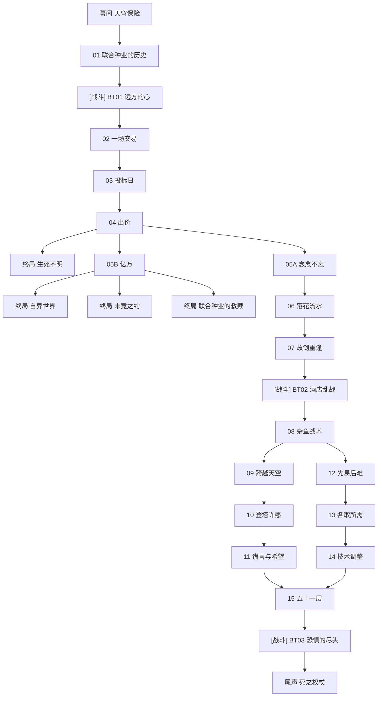

# 主线 第七章《星之竞拍》 概览

## 章节基本信息
- **章节全称**：第七章 《星之竞拍》
- **发生时间**：星塔历 996 年
- **包含小节数**：共 25 个小节（包含剧情关卡与战斗关卡）

## 章节剧情分支路线图 (Story Route DAG)
以下流程图清晰展示了本章所有关卡的推进顺序、分支路径、战斗节点与可能达成的各路线结局：

## 关卡小节列表与剧情直达 (Sections)
| 关卡编号 | 关卡名称 | 类型 | 推荐等级 | 独立小节剧情与台词文档 |
| :--- | :--- | :--- | :--- | :--- |
| BT01 | 远方的心 | ⚔️ 战斗关卡 | Lv.- | [远方的心](./sections/801_BT01_远方的心.md) |
| BT02 | 酒店乱战 | ⚔️ 战斗关卡 | Lv.- | [酒店乱战](./sections/802_BT02_酒店乱战.md) |
| BT03 | 恐惧的尽头 | ⚔️ 战斗关卡 | Lv.- | [恐惧的尽头](./sections/803_BT03_恐惧的尽头.md) |
| 幕间 | 天穹保险 | 📖 剧情关卡 | Lv.- | [天穹保险](./sections/804_幕间_天穹保险.md) |
| 01 | 联合种业的历史 | 📖 剧情关卡 | Lv.- | [联合种业的历史](./sections/805_01_联合种业的历史.md) |
| 02 | 一场交易 | 📖 剧情关卡 | Lv.- | [一场交易](./sections/806_02_一场交易.md) |
| 03 | 投标日 | 📖 剧情关卡 | Lv.- | [投标日](./sections/807_03_投标日.md) |
| 04 | 出价 | 📖 剧情关卡 | Lv.- | [出价](./sections/808_04_出价.md) |
| 终局 | 生死不明 | 📖 剧情关卡 | Lv.- | [生死不明](./sections/809_终局_生死不明.md) |
| 05A | 念念不忘 | 📖 剧情关卡 | Lv.- | [念念不忘](./sections/810_05A_念念不忘.md) |
| 05B | 亿万 | 📖 剧情关卡 | Lv.- | [亿万](./sections/811_05B_亿万.md) |
| 终局 | 自异世界 | 📖 剧情关卡 | Lv.- | [自异世界](./sections/812_终局_自异世界.md) |
| 终局 | 未竟之约 | 📖 剧情关卡 | Lv.- | [未竟之约](./sections/813_终局_未竟之约.md) |
| 终局 | 联合种业的救赎 | 📖 剧情关卡 | Lv.- | [联合种业的救赎](./sections/814_终局_联合种业的救赎.md) |
| 06 | 落花流水 | 📖 剧情关卡 | Lv.- | [落花流水](./sections/815_06_落花流水.md) |
| 07 | 故剑重逢 | 📖 剧情关卡 | Lv.- | [故剑重逢](./sections/816_07_故剑重逢.md) |
| 08 | 杂鱼战术 | 📖 剧情关卡 | Lv.- | [杂鱼战术](./sections/817_08_杂鱼战术.md) |
| 09 | 跨越天空 | 📖 剧情关卡 | Lv.- | [跨越天空](./sections/818_09_跨越天空.md) |
| 12 | 先易后难 | 📖 剧情关卡 | Lv.- | [先易后难](./sections/819_12_先易后难.md) |
| 10 | 登塔许愿 | 📖 剧情关卡 | Lv.- | [登塔许愿](./sections/820_10_登塔许愿.md) |
| 11 | 谎言与希望 | 📖 剧情关卡 | Lv.- | [谎言与希望](./sections/821_11_谎言与希望.md) |
| 13 | 各取所需 | 📖 剧情关卡 | Lv.- | [各取所需](./sections/822_13_各取所需.md) |
| 14 | 技术调整 | 📖 剧情关卡 | Lv.- | [技术调整](./sections/823_14_技术调整.md) |
| 15 | 五十一层 | 📖 剧情关卡 | Lv.- | [五十一层](./sections/824_15_五十一层.md) |
| 尾声 | 死之权杖 | 📖 剧情关卡 | Lv.- | [死之权杖](./sections/825_尾声_死之权杖.md) |
