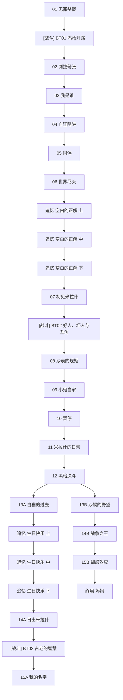

# 主线 第八章《往日残影》 概览

## 章节基本信息
- **章节全称**：第八章 《往日残影》
- **发生时间**：星塔历 996 年
- **包含小节数**：共 28 个小节（包含剧情关卡与战斗关卡）

## 章节剧情分支路线图 (Story Route DAG)
以下流程图清晰展示了本章所有关卡的推进顺序、分支路径、战斗节点与可能达成的各路线结局：

## 关卡小节列表与剧情直达 (Sections)
| 关卡编号 | 关卡名称 | 类型 | 推荐等级 | 独立小节剧情与台词文档 |
| :--- | :--- | :--- | :--- | :--- |
| 01 | 无罪杀戮 | 📖 剧情关卡 | Lv.- | [无罪杀戮](./sections/901_01_无罪杀戮.md) |
| BT01 | 鸣枪开路 | ⚔️ 战斗关卡 | Lv.- | [鸣枪开路](./sections/902_BT01_鸣枪开路.md) |
| 02 | 剑拔弩张 | 📖 剧情关卡 | Lv.- | [剑拔弩张](./sections/903_02_剑拔弩张.md) |
| 03 | 我是谁 | 📖 剧情关卡 | Lv.- | [我是谁](./sections/904_03_我是谁.md) |
| 04 | 自证陷阱 | 📖 剧情关卡 | Lv.- | [自证陷阱](./sections/905_04_自证陷阱.md) |
| 05 | 同伴 | 📖 剧情关卡 | Lv.- | [同伴](./sections/906_05_同伴.md) |
| 06 | 世界尽头 | 📖 剧情关卡 | Lv.- | [世界尽头](./sections/907_06_世界尽头.md) |
| 追忆 | 空白的正解 上 | 📖 剧情关卡 | Lv.- | [空白的正解 上](./sections/908_追忆_空白的正解_上.md) |
| 追忆 | 空白的正解 中 | 📖 剧情关卡 | Lv.- | [空白的正解 中](./sections/909_追忆_空白的正解_中.md) |
| 追忆 | 空白的正解 下 | 📖 剧情关卡 | Lv.- | [空白的正解 下](./sections/910_追忆_空白的正解_下.md) |
| 07 | 初见米拉什 | 📖 剧情关卡 | Lv.- | [初见米拉什](./sections/911_07_初见米拉什.md) |
| BT02 | 好人、坏人与丑角 | ⚔️ 战斗关卡 | Lv.- | [好人、坏人与丑角](./sections/912_BT02_好人_坏人与丑角.md) |
| 08 | 沙漠的规矩 | 📖 剧情关卡 | Lv.- | [沙漠的规矩](./sections/913_08_沙漠的规矩.md) |
| 09 | 小鬼当家 | 📖 剧情关卡 | Lv.- | [小鬼当家](./sections/914_09_小鬼当家.md) |
| 10 | 暂停 | 📖 剧情关卡 | Lv.- | [暂停](./sections/915_10_暂停.md) |
| 11 | 米拉什的日常 | 📖 剧情关卡 | Lv.- | [米拉什的日常](./sections/916_11_米拉什的日常.md) |
| 12 | 黑暗决斗 | 📖 剧情关卡 | Lv.- | [黑暗决斗](./sections/917_12_黑暗决斗.md) |
| 13A | 白猫的过去 | 📖 剧情关卡 | Lv.- | [白猫的过去](./sections/918_13A_白猫的过去.md) |
| 13B | 沙蝎的野望 | 📖 剧情关卡 | Lv.- | [沙蝎的野望](./sections/919_13B_沙蝎的野望.md) |
| 追忆 | 生日快乐 上 | 📖 剧情关卡 | Lv.- | [生日快乐 上](./sections/920_追忆_生日快乐_上.md) |
| 追忆 | 生日快乐 中 | 📖 剧情关卡 | Lv.- | [生日快乐 中](./sections/921_追忆_生日快乐_中.md) |
| 追忆 | 生日快乐 下 | 📖 剧情关卡 | Lv.- | [生日快乐 下](./sections/922_追忆_生日快乐_下.md) |
| 14A | 日出米拉什 | 📖 剧情关卡 | Lv.- | [日出米拉什](./sections/923_14A_日出米拉什.md) |
| 14B | 战争之王 | 📖 剧情关卡 | Lv.- | [战争之王](./sections/924_14B_战争之王.md) |
| BT03 | 古老的智慧 | ⚔️ 战斗关卡 | Lv.- | [古老的智慧](./sections/925_BT03_古老的智慧.md) |
| 15A | 我的名字 | 📖 剧情关卡 | Lv.- | [我的名字](./sections/926_15A_我的名字.md) |
| 15B | 蝴蝶效应 | 📖 剧情关卡 | Lv.- | [蝴蝶效应](./sections/927_15B_蝴蝶效应.md) |
| 终局 | 妈妈 | 📖 剧情关卡 | Lv.- | [妈妈](./sections/928_终局_妈妈.md) |
