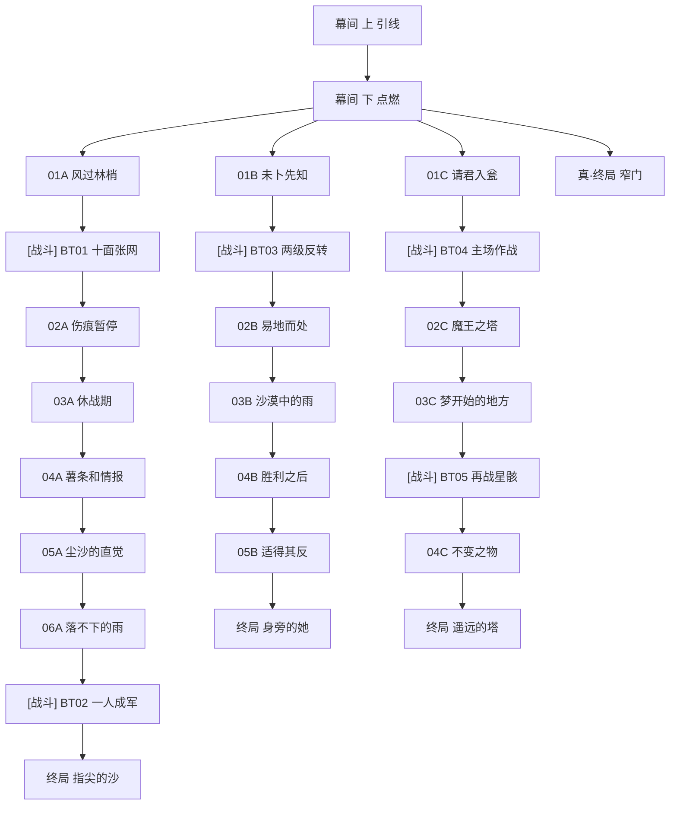

# 主线 第九章《遥远的塔》 概览

## 章节基本信息
- **章节全称**：第九章 《遥远的塔》
- **发生时间**：星塔历 996 年
- **包含小节数**：共 26 个小节（包含剧情关卡与战斗关卡）

## 章节剧情分支路线图 (Story Route DAG)
以下流程图清晰展示了本章所有关卡的推进顺序、分支路径、战斗节点与可能达成的各路线结局：

## 关卡小节列表与剧情直达 (Sections)
| 关卡编号 | 关卡名称 | 类型 | 推荐等级 | 独立小节剧情与台词文档 |
| :--- | :--- | :--- | :--- | :--- |
| 幕间 上 | 引线 | 📖 剧情关卡 | Lv.- | [引线](./sections/1001_幕间_上_引线.md) |
| 幕间 下 | 点燃 | 📖 剧情关卡 | Lv.- | [点燃](./sections/1002_幕间_下_点燃.md) |
| 01A | 风过林梢 | 📖 剧情关卡 | Lv.- | [风过林梢](./sections/1003_01A_风过林梢.md) |
| BT01 | 十面张网 | ⚔️ 战斗关卡 | Lv.5 | [十面张网](./sections/1004_BT01_十面张网.md) |
| 02A | 伤痕暂停 | 📖 剧情关卡 | Lv.- | [伤痕暂停](./sections/1005_02A_伤痕暂停.md) |
| 03A | 休战期 | 📖 剧情关卡 | Lv.- | [休战期](./sections/1006_03A_休战期.md) |
| 04A | 薯条和情报 | 📖 剧情关卡 | Lv.- | [薯条和情报](./sections/1007_04A_薯条和情报.md) |
| 05A | 尘沙的直觉 | 📖 剧情关卡 | Lv.- | [尘沙的直觉](./sections/1008_05A_尘沙的直觉.md) |
| 06A | 落不下的雨 | 📖 剧情关卡 | Lv.- | [落不下的雨](./sections/1009_06A_落不下的雨.md) |
| BT02 | 一人成军 | ⚔️ 战斗关卡 | Lv.5 | [一人成军](./sections/1010_BT02_一人成军.md) |
| 终局 | 指尖的沙 | 📖 剧情关卡 | Lv.- | [指尖的沙](./sections/1011_终局_指尖的沙.md) |
| 01B | 未卜先知 | 📖 剧情关卡 | Lv.- | [未卜先知](./sections/1012_01B_未卜先知.md) |
| BT03 | 两级反转 | ⚔️ 战斗关卡 | Lv.5 | [两级反转](./sections/1013_BT03_两级反转.md) |
| 02B | 易地而处 | 📖 剧情关卡 | Lv.- | [易地而处](./sections/1014_02B_易地而处.md) |
| 03B | 沙漠中的雨 | 📖 剧情关卡 | Lv.- | [沙漠中的雨](./sections/1015_03B_沙漠中的雨.md) |
| 04B | 胜利之后 | 📖 剧情关卡 | Lv.- | [胜利之后](./sections/1016_04B_胜利之后.md) |
| 05B | 适得其反 | 📖 剧情关卡 | Lv.- | [适得其反](./sections/1017_05B_适得其反.md) |
| 终局 | 身旁的她 | 📖 剧情关卡 | Lv.- | [身旁的她](./sections/1018_终局_身旁的她.md) |
| 01C | 请君入瓮 | 📖 剧情关卡 | Lv.- | [请君入瓮](./sections/1019_01C_请君入瓮.md) |
| BT04 | 主场作战 | ⚔️ 战斗关卡 | Lv.5 | [主场作战](./sections/1020_BT04_主场作战.md) |
| 02C | 魔王之塔 | 📖 剧情关卡 | Lv.- | [魔王之塔](./sections/1021_02C_魔王之塔.md) |
| 03C | 梦开始的地方 | 📖 剧情关卡 | Lv.- | [梦开始的地方](./sections/1022_03C_梦开始的地方.md) |
| BT05 | 再战星骸 | ⚔️ 战斗关卡 | Lv.5 | [再战星骸](./sections/1023_BT05_再战星骸.md) |
| 04C | 不变之物 | 📖 剧情关卡 | Lv.- | [不变之物](./sections/1024_04C_不变之物.md) |
| 终局 | 遥远的塔 | 📖 剧情关卡 | Lv.- | [遥远的塔](./sections/1025_终局_遥远的塔.md) |
| 真·终局 | 窄门 | 📖 剧情关卡 | Lv.- | [窄门](./sections/1026_真_终局_窄门.md) |
