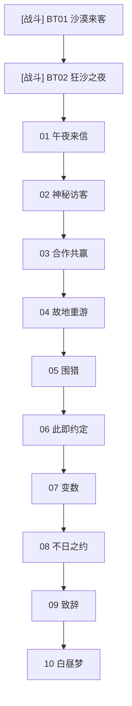

# 主线 特别篇《谜影的序曲》 概览

## 章节基本信息
- **章节全称**：特别篇 《谜影的序曲》
- **发生时间**：星塔历 996 年
- **包含小节数**：共 12 个小节（包含剧情关卡与战斗关卡）

## 章节剧情分支路线图 (Story Route DAG)
以下流程图清晰展示了本章所有关卡的推进顺序、分支路径、战斗节点与可能达成的各路线结局：

## 关卡小节列表与剧情直达 (Sections)
| 关卡编号 | 关卡名称 | 类型 | 推荐等级 | 独立小节剧情与台词文档 |
| :--- | :--- | :--- | :--- | :--- |
| BT01 | 沙漠来客 | ⚔️ 战斗关卡 | Lv.- | [沙漠来客](./sections/6501_BT01_沙漠来客.md) |
| BT02 | 狂沙之夜 | ⚔️ 战斗关卡 | Lv.- | [狂沙之夜](./sections/6502_BT02_狂沙之夜.md) |
| 01 | 午夜来信 | 📖 剧情关卡 | Lv.- | [午夜来信](./sections/6503_01_午夜来信.md) |
| 02 | 神秘访客 | 📖 剧情关卡 | Lv.- | [神秘访客](./sections/6504_02_神秘访客.md) |
| 03 | 合作共赢 | 📖 剧情关卡 | Lv.- | [合作共赢](./sections/6505_03_合作共赢.md) |
| 04 | 故地重游 | 📖 剧情关卡 | Lv.- | [故地重游](./sections/6506_04_故地重游.md) |
| 05 | 围猎 | 📖 剧情关卡 | Lv.- | [围猎](./sections/6507_05_围猎.md) |
| 06 | 此即约定 | 📖 剧情关卡 | Lv.- | [此即约定](./sections/6508_06_此即约定.md) |
| 07 | 变数 | 📖 剧情关卡 | Lv.- | [变数](./sections/6509_07_变数.md) |
| 08 | 不日之约 | 📖 剧情关卡 | Lv.- | [不日之约](./sections/6510_08_不日之约.md) |
| 09 | 致辞 | 📖 剧情关卡 | Lv.- | [致辞](./sections/6511_09_致辞.md) |
| 10 | 白昼梦 | 📖 剧情关卡 | Lv.- | [白昼梦](./sections/6512_10_白昼梦.md) |
